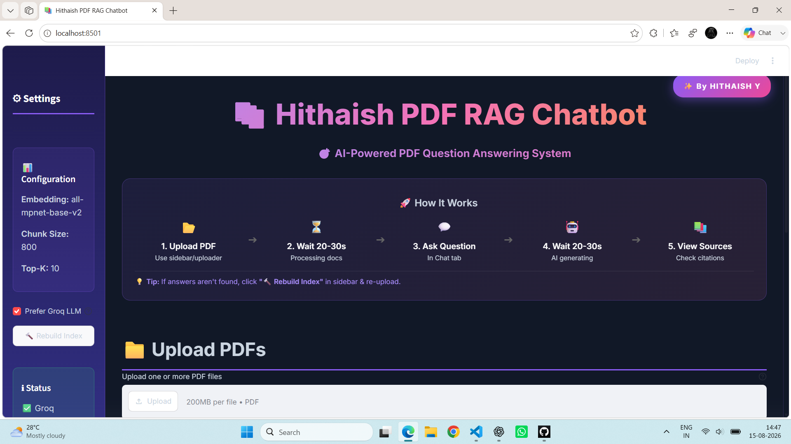
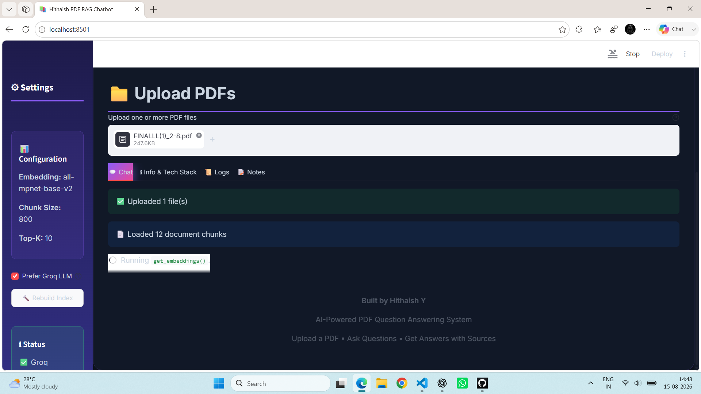
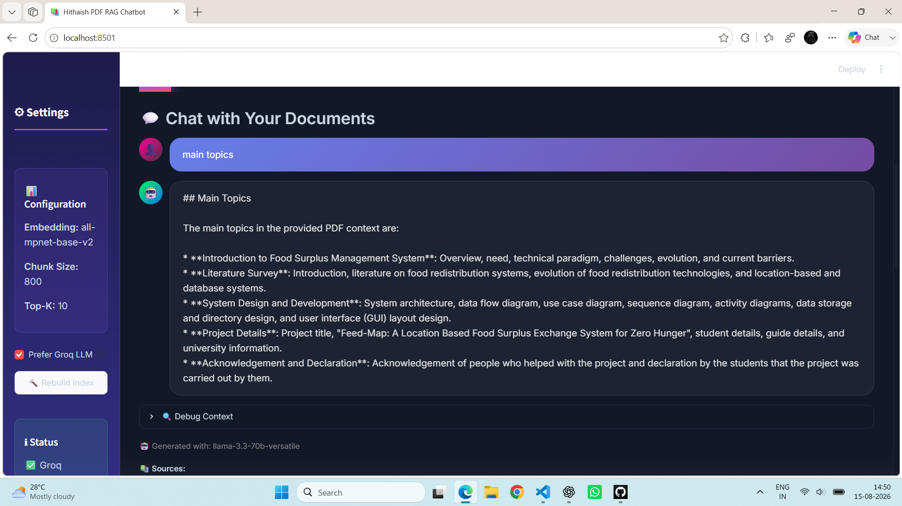
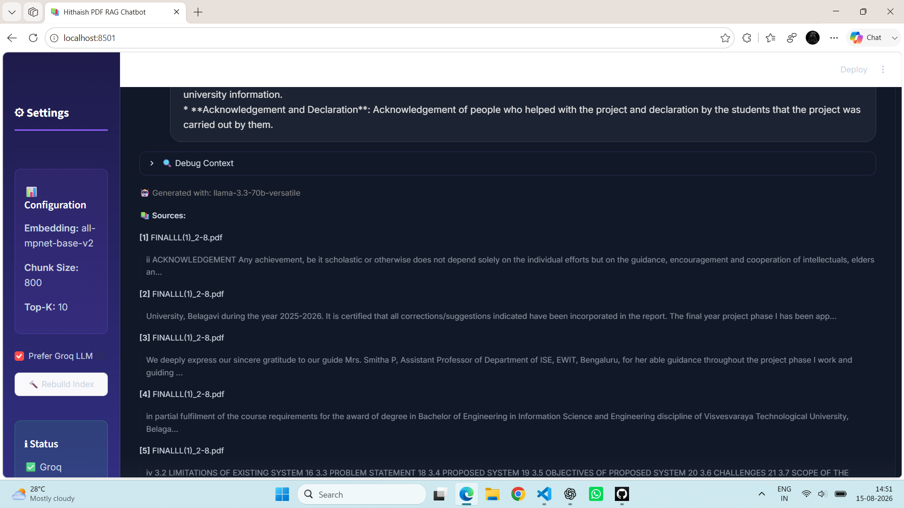

🤖 Hithaish PDF RAG Chatbot

An AI-powered PDF Question Answering System that allows users to
upload PDF documents, ask questions in natural language, and receive
answers with relevant source information.

🖥️ Project Screenshots

🏠 Main Page

📄 PDF Upload

💬 Chatbot Answer

📚 Source Citations

📌 About the Project

Hithaish PDF RAG Chatbot is a Retrieval-Augmented Generation (RAG)
application designed to make information retrieval from PDF documents
easier.

Users can upload one or more PDF documents and ask questions about their
content. The application processes the uploaded documents, creates
searchable vector representations, retrieves relevant document sections,
and uses an AI language model to generate an answer.

The application also displays source information so users can understand
which document content was used to generate the response.

✨ Features

📄 Upload one or multiple PDF documents

🤖 AI-powered question answering

🔎 Retrieval-Augmented Generation (RAG)

🧠 HuggingFace sentence embeddings

🗂️ FAISS vector similarity search

⚡ Groq-powered LLM inference

🔗 Source citations for generated answers

💬 Conversational question answering

🧹 Clear conversation history

📥 Chat history export

🔄 Rebuild FAISS index

⚙️ Configurable chunk size and Top-K retrieval

🖥️ Interactive Streamlit interface

📚 Multiple PDF support

🔐 API keys stored using Streamlit secrets

🛠️ Tech Stack

Technology                 Purpose

Python                     Application development
Streamlit                  Interactive web interface
LangChain                  RAG pipeline and document processing
FAISS                      Vector similarity search
HuggingFace Transformers   Text embeddings
Groq                       Fast LLM inference
PyMuPDF                    PDF text extraction
Unstructured               Document processing
Python-dotenv              Environment configuration

🧠 System Architecture

                         ┌─────────────────────┐
                         │      PDF Upload     │
                         └──────────┬──────────┘
                                    │
                                    ▼
                         ┌─────────────────────┐
                         │   PDF Text          │
                         │   Extraction        │
                         └──────────┬──────────┘
                                    │
                                    ▼
                         ┌─────────────────────┐
                         │   Text Chunking     │
                         └──────────┬──────────┘
                                    │
                                    ▼
                         ┌─────────────────────┐
                         │ HuggingFace         │
                         │ Embeddings          │
                         └──────────┬──────────┘
                                    │
                                    ▼
                         ┌─────────────────────┐
                         │   FAISS Vector      │
                         │   Index             │
                         └──────────┬──────────┘
                                    │
                                    │
                 ┌──────────────────┴──────────────────┐
                 │                                     │
                 ▼                                     │
        ┌─────────────────────┐                         │
        │    User Question    │                         │
        └──────────┬──────────┘                         │
                   │                                    │
                   ▼                                    │
        ┌─────────────────────┐                         │
        │ Similarity Search   │◄────────────────────────┘
        │      Top-K          │
        └──────────┬──────────┘
                   │
                   ▼
        ┌─────────────────────┐
        │ Retrieved Context   │
        └──────────┬──────────┘
                   │
                   ▼
        ┌─────────────────────┐
        │    Groq LLM         │
        │    Generation       │
        └──────────┬──────────┘
                   │
                   ▼
        ┌─────────────────────┐
        │ Answer + Sources    │
        └─────────────────────┘

🔄 RAG Workflow

1. Upload PDF

The user uploads one or more PDF documents through the Streamlit
interface.

2. Extract Text

Text is extracted from the uploaded PDF documents.

3. Split Documents

The extracted text is divided into smaller chunks to make retrieval more
efficient.

4. Generate Embeddings

The text chunks are converted into numerical vector representations
using HuggingFace embeddings.

5. Store in FAISS

The generated embeddings are stored in a FAISS vector index.

6. Ask a Question

The user enters a natural-language question related to the uploaded PDF.

7. Retrieve Relevant Content

FAISS performs similarity search and retrieves the most relevant
document chunks.

8. Generate Answer

The retrieved context is provided to the language model through the RAG
pipeline.

9. Display Sources

The application displays relevant source information along with the
generated answer.

🖥️ User Interface

The application provides an interactive Streamlit interface for working
with uploaded PDF documents.

Main Page

The main page provides:

Application title

Configuration settings

PDF upload functionality

RAG status information

Chat interface

Source information

PDF Upload

Users can upload PDF documents directly through the application.

Chatbot

Users can ask questions about uploaded documents and receive
AI-generated answers.

Source Citations

The application displays relevant source information associated with the
generated answer.

📂 Project Structure

pdf-rag-chatbot/
│
├── app.py
├── requirements.txt
├── README.md
├── QUICKSTART.md
├── Dockerfile
├── run.bat
├── setup.bat
├── .gitignore
│
├── .streamlit/
│   └── secrets.toml
│
├── screenshots/
│   ├── main-page.png
│   ├── pdf-upload.png
│   ├── chatbot-answer.png
│   └── sources.png
│
├── faiss_index_storage/
│   ├── index.faiss
│   └── index.pkl
│
└── uploaded_pdfs/

⚙️ Configuration

The application uses Streamlit secrets for API credentials.

Create:

.streamlit/secrets.toml

Example:

GROQ_API_KEY = "your_groq_api_key"

If your application uses additional API keys, configure them according
to the variables used in app.py.

⚠️ Never publish real API keys in your repository.

🚀 Installation

1. Clone the Repository

git clone https://github.com/hithaish-y/pdf-rag-chatbot.git

2. Open the Project

cd pdf-rag-chatbot

3. Create a Virtual Environment

python -m venv venv

4. Activate the Environment

Windows

venv\Scripts\activate

5. Install Dependencies

pip install -r requirements.txt

▶️ Run the Application

streamlit run app.py

The application will open in your browser.

💬 Usage

Open the application.

Upload one or more PDF documents.

Wait for the documents to be processed.

Enter a question related to the uploaded document.

Submit the question.

Read the generated answer.

Check the displayed source information.

🔎 Retrieval Configuration

The application supports configurable retrieval parameters.

Chunk Size

Controls the amount of text contained in each document chunk.

Top-K

Controls the number of relevant document chunks retrieved for a query.

These parameters can be adjusted according to the document size and
retrieval requirements.

📊 Why RAG?

Retrieval-Augmented Generation combines document retrieval with
language-model generation.

User Documents
      ↓
Document Processing
      ↓
Text Chunking
      ↓
Vector Embeddings
      ↓
FAISS Vector Search
      ↓
Relevant Context
      ↓
Language Model
      ↓
Grounded Answer

This allows the chatbot to generate answers using information retrieved
from the uploaded documents.

🔐 Security

API keys should be stored in Streamlit secrets.

Sensitive credentials should never be committed to GitHub.

.gitignore should be used to prevent accidental credential
uploads.

Private uploaded documents should not be committed to the
repository.

🐛 Troubleshooting

Application does not start

Install the required dependencies:

pip install -r requirements.txt

Then run:

streamlit run app.py

API Key Error

Check that the required API key is correctly configured in:

.streamlit/secrets.toml

Answers are not found

Try:

Re-uploading the PDF.

Rebuilding the FAISS index.

Asking a question directly related to the PDF.

Checking that the PDF contains readable text.

Screenshots are not displayed

Make sure these files exist in the repository:

## 🖥️ UI Screenshots

### 🏠 Main Page

### 📄 PDF Upload

### 💬 Chatbot Answer

### 📚 Sources

The filenames and folder name must match the paths used in this README.

📦 Dependencies

Project dependencies are listed in:

requirements.txt

Install them using:

pip install -r requirements.txt

🌟 Project Highlights

🤖 AI-powered PDF question answering

📚 Retrieval-Augmented Generation

🔎 Semantic document retrieval

⚡ Fast LLM inference

🧠 Vector embeddings

🗂️ FAISS similarity search

💬 Conversational interface

📑 Source-aware answers

🖥️ Streamlit web application

🎯 Future Improvements

🌐 Online deployment

👥 User authentication

☁️ Cloud-based document storage

🗃️ Persistent document management

📊 Usage analytics

🔐 Advanced access control

📱 Improved responsive interface

🧠 Additional embedding models

📄 Support for additional document formats

👨‍💻 Author

Hithaish Y

Information Science Engineering Student

GitHub:
https://github.com/hithaish-y

LinkedIn:
https://www.linkedin.com/in/hithaish-y-9856562a1

::: {align="center"}

🤖 Hithaish PDF RAG Chatbot

Built with ❤️ using Python, LangChain, FAISS, Groq, Streamlit and
HuggingFace.

Upload PDFs • Ask Questions • Get AI-Powered Answers • View Sources
:::